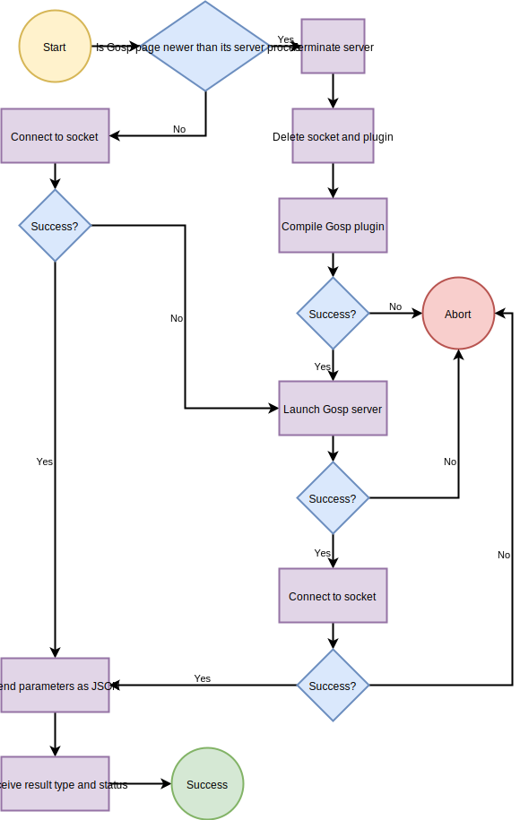

Implementation overview
=======================

Most users will not need the information on this page.  It explains the basic structure of the Go Server Pages implementation.  The target audience comprises advanced users who want a better understanding of how Go Server Pages works and developers who want to modify or extend the tool's behavior.

Apache module
-------------

Go Server Pages integrates with the [Apache Web server](https://httpd.apache.org/) in the form of an Apache module.  The source code for the Apache module lies in the [`module`](https://github.com/spakin/gosp/tree/master/module) directory.  The module performs a number of tasks:

* processing Go Server Pages-related directives appearing in the configuration file,

* compiling pages to Go plugins using `gosp2go`,

* running Go plugins using `gosp-server`,

* sending client request data to the Go plugin, and

* sending the output of the Go plugin back to the client.

The following flowchart illustrates the Go Server Pages module's control flow when processing a request from a client:



The left side of the flowchart corresponds to the common case of an up-to-date version of the Go Server Pages plugin already being running.  The right side of the flowchart corresponds to the plugin not existing, in which case it is compiled and launched; or outdated, in which case it is stopped, recompiled, and launched.  While not shown in the figure, the actions on the right side of the figure are protected by a mutex to ensure that concurrent accesses to an outdated or nonexistent plugin do not trigger multiple compilations or launches of the same plugin.

If the Abort state in the flowchart is reached, the Go Server Pages Apache module returns to the client an HTTP Internal Server Error (status code 500).

Page compiler
-------------

The purpose of `gosp2go`, the Go Server Pages page compiler, is to compile a Go Server Page from HTML with embedded Go code to a Go function that both executes code and outputs HTML.  (We write "HTML" here, but a Go Server Page can in fact use any file format.)  For example, the HTML fragment
```html
<p>
  Let's sing: <q>Na<?go:expr strings.Repeat(" na", 7) ?>,
  <?go:expr strings.Repeat(" na", 8) ?>, Batman!</q>
</p>
```
compiles to the Go fragment,
```go
gosp.Fprintf(gospOut, "%s", "<p>\n  Let's sing: <q>Na")
gosp.Fprintf(gospOut, "%v%s", strings.Repeat(" na", 7), "")
gosp.Fprintf(gospOut, "%s", ",\n  ")
gosp.Fprintf(gospOut, "%v%s", strings.Repeat(" na", 8), "")
gosp.Fprintf(gospOut, "%s", ", Batman!</q>\n</p>\n")
```

This code fragment is written as part of a `GospGenerateHTML` function of type
```go
func(gospReq *gosp.RequestData, gospOut gosp.Writer, gospMeta gosp.Metadata)
```
See [`boilerplate.go`](https://github.com/spakin/gosp/tree/master/tools/src/gosp2go/boilerplate.go) for the latest definition of the boilerplate code that wraps the code generated from the contents of the Go Server Page.  The only package the boilerplate code imports is `gosp`, described below.

The source code for the compiler lies in the [`gosp2go`](https://github.com/spakin/gosp/tree/master/tools/src/gosp2go) directory.  `gosp2go`'s default behavior is to produce Go source code, which can be useful for troubleshooting a Go Server Page.  When invoked from the Go Server Pages Apache module, `gosp2go` is instructed via the `--build` option not only to generate Go code but also to compile the result to a shared object (plugin).  `gosp2go` can also be invoked with the `--run` option to compile, generate a plugin, and run the plugin using `gosp-server` (described below).  This can be useful for post-processing the output of a [CGI](https://en.wikipedia.org/wiki/Common_Gateway_Interface) script that generates a Go Server Page instead of ordinary HTML.

Back-end server
---------------

`gosp-server`, Go Server Pages's back-end server, loads a plugin generated by the page compiler and uses it to service page requests.  There is virtually no need to run it explicitly, though.  It will normally be run implicitly by either the Apache module or by an invocation of `gosp2go --run`.

The back-end server accepts requests in [JSON](https://json.org/) format, specifically a record containing a `gosp.RequestData` and a Boolean `ExitNow` flag.  If `ExitNow` is `true`, the server will stop accepting new requests, wait until all current requests complete, and exit cleanly.  Otherwise, it invokes the plugin-provided `GospGenerateHTML` function, passing it the `gosp.RequestData`, a [`*bytes.Buffer`](https://golang.org/pkg/bytes/#Buffer) to use for data output (`gospOut`), and a `gosp.Metadata` (really a channel of type `gosp.KeyValue`) to use for HTTP metadata output.  When `GospGenerateHTML` returns, if the HTTP metadata indicates a status code of anything except `OK` (200), the server discards the data and returns only the metadata.

If run with `--socket`=*filename*, `gosp-server` accepts JSON requests from local (e.g., Unix-domain) socket *filename* and sends back its response via a corresponding local socket.  This is how the Apache module launches `gosp-server`.  If run with `--file`=*filename*, `gosp-server` reads a JSON request from file *filename* and outputs its response to the standard output device.  If neither `--socket` nor `--file` is specified, `gosp-server` passes an empty request to `GospGenerateHTML`.  This is how `gosp2go` launches `gosp-server`.

The source code for the back-end server lies in the [`gosp-server`](https://github.com/spakin/gosp/tree/master/tools/src/gosp-server) directory. 

Helper package
--------------

Go Server Pages defines a `gosp` Go package that serves two purposes:

1. It provides all the functionality needed by the generated `GospGenerateHTML` function to produce a Web page.

2. It exposes a few key functions and data types to Go Server Pages so even a page that is not authorized to import any Go packages whatsoever (see [Configuring Go Server Pages](configure.md)) can still produce Web-page data and can still open for reading any file that lies in the same directory or a subdirectory.

The source code for the helper package lies in the [`gosp`](https://github.com/spakin/gosp/tree/master/tools/src/gosp) directory.  Look there for the definition of `gosp.RequestData`, the set of all client and server data passed in from the Apache module for use by a Go Server Page.
